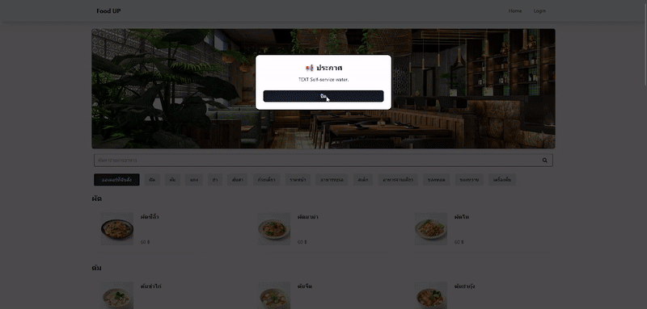

# FOOD UP
This project is part of the CSS222 Database course. The objective is to develop a website that uses MySQL as the database and fully supports end-to-end CRUD (Create, Read, Update, Delete) operations.

based on a real problem I persornally encountered when ordering food. Miscommunication between customers and the restaurant often leads to incorrect orders and wasted time spent resolving these issues.

From this problem, I developed *FOOD UP* a restaurant website system designed to reduce miscommunication by enabling direct communication between customers and restaurants through the platform.

Restaurant owners can customize their restaurant name, banner and description with full flexibility, while customer can easily search and place orders conveniently.

User Feature
- Scan QR code to place order
- Check status and table total
- Search for menu items

Admin Feature
- Customize restaurant name and banner
- Crete / Delete / Edit announcement
- Crete / Delete / Edit menu category
- Crete / Delete / Edit menu items
- receive order and update order status
- view monthly summary graphs

Stack using
- Front-end: React (TypScript), Vite, TailwindCSS
- Back-end: Node.js (TypeScript)
- Database: MySQL